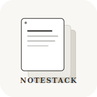

# NoteStack

<div align="center">



**Capture. Organize. Stack.**

A full-stack note-taking application with JWT authentication.

[](https://www.java.com/)
[](https://spring.io/projects/spring-boot)
[](https://angular.io/)
[](https://www.postgresql.org/)

[API Documentation](docs/API.md) • [Frontend Documentation](docs/FRONTEND.md) • [Pages & Routes](docs/PAGES.md)

</div>

## Overview

NoteStack is a cloud-based note-taking application with JWT authentication, built with Spring Boot on the backend and Angular on the frontend. Capture your ideas, organize them effortlessly, and access them anywhere.

## Quick Start

### 1. Start the database

```bash
cd notetakingapp
docker-compose up -d
```

### 2. Start the application

```bash
npm run dev
```

### 3. Access the application

| Service | URL |
|---------|-----|
| Frontend | http://localhost:4200 |
| Backend API | http://localhost:8080/api |
| Swagger Docs | http://localhost:8080/swagger-ui.html |

## Features

- JWT Authentication
- REST API with full CRUD operations
- Swagger/OpenAPI documentation
- Angular Material UI
- PostgreSQL database with Flyway migrations
- Responsive design
- Secure user registration & login
